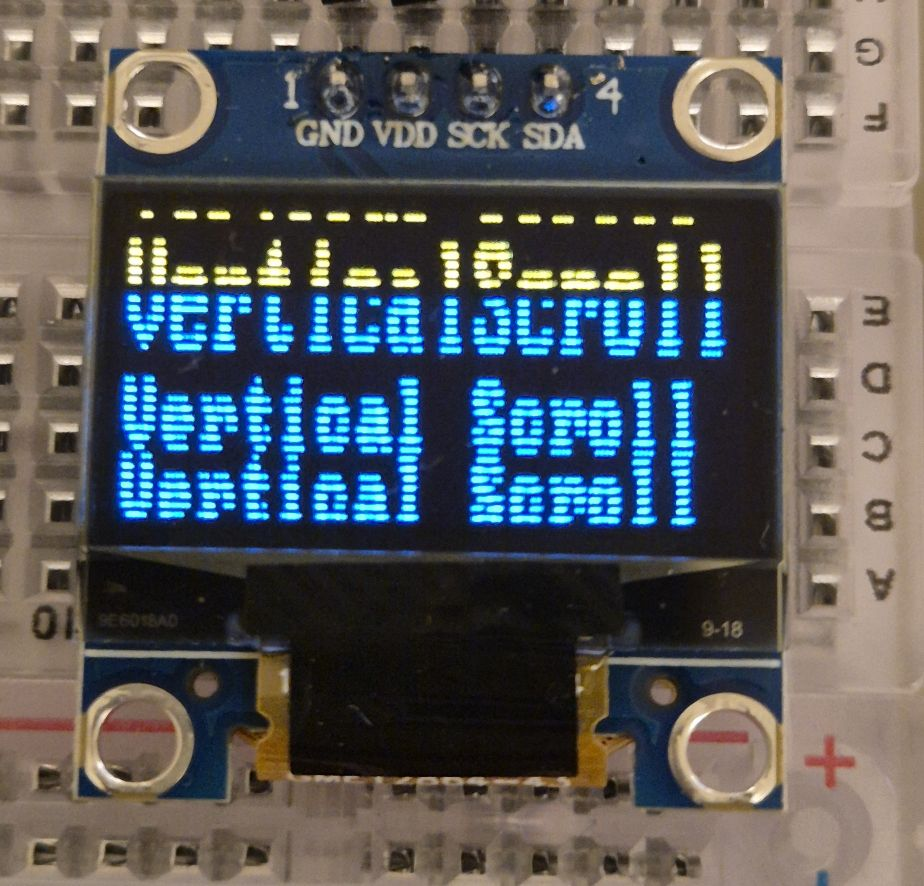

# SSD1306 MicroPython Driver

MicroPython driver for the SSD1306 OLED display on ESP32, built from scratch with no external library dependencies.

## Supported Hardware

- **Microcontroller:** ESP32 DevKit (tested on ESP32-D0WD-V3 rev 3.1)
- **Display:** SSD1306 OLED 128x32 via I2C
- **MicroPython:** v1.27.0

> **Note:** This driver is configured for **128x32** displays. For 128x64 displays, adjust `INIT_SEQ` (`0xA8, 0x3F` and `0x22, 0x00, 0x07`) and the framebuffer size (1024 bytes).

## Usage Examples

  Temperature and humidity display using AHT10 sensor.

  Four lines using 8x8 font.

  Three lines using 8x16 font.

  The `flash()` method cycling all pixels on and off.

  Vertical scroll using `D3` command.

  Horizontal scroll using `0x26/0x27` commands.

  Custom symbols — UP_ARROW and DOWN_ARROW constants.

## Wiring

| SSD1306 | ESP32  |
|---------|--------|
| GND     | GND    |
| VDD     | 3.3V   |
| SCK     | GPIO22 |
| SDA     | GPIO21 |

## Installation

Copy `ssd1306.py` to your ESP32 using Thonny (`File → Save as → MicroPython device`).

> Tested with [Thonny IDE](https://thonny.org/) and MicroPython v1.27.0.

## Basic Usage

```python
from machine import Pin, SoftI2C
from ssd1306 import SSD1306

sda = Pin(21)
scl = Pin(22)
i2c = SoftI2C(scl=scl, sda=sda, freq=400_000)

display = SSD1306(i2c)

display.text('Hello World', 0, 24, 8)
display.text('28.3°C  73%', 0, 8, 16)
display.show()
```

## API

### `__init__(bus, addr=0x3C)`
Initializes the display and clears the screen.

### `__repr__()`
Returns a string representation of the instance.

### `clean()`
Clears all pixels, resets the framebuffer, and updates the display.

### `show()`
Sends the framebuffer to the display. Must be called after `pixel()` or `text()` operations.

### `send_command(command)`
Sends raw SSD1306 commands as `bytearray`. For advanced use.

Example — horizontal scroll:
```python
display.send_command(bytearray([
    0x2E,        # deactivate scroll
    0x26,        # scroll right (0x27 = left)
    0x00,        # dummy byte
    0x00,        # start page
    0x00,        # speed (0x00 = fastest)
    0x03,        # end page
    0x00, 0xFF,  # dummy bytes
    0x2F,        # activate scroll
]))
```

### `pixel(x, y, state=True)`
Turns a pixel on (`True`) or off (`False`) at position (x, y).
- x: 0 to 127
- y: 0 to 31 (0 = bottom, 31 = top)

### `text(str_text, x, y, size=8)`
Renders a string on the display.
- `size=8`: 8x8 pixel font
- `size=16`: 8x16 pixel font
- Supports `°` (degree) symbol and custom symbols defined as class constants
- Unmapped characters fall back to space

### `flash(n=3, on=300, off=100)`
Flashes all pixels on/off `n` times. `on` and `off` durations in milliseconds.

### `dot_2x2(x, y, state=True)`
Draws or erases a 2×2 pixel block at position (x, y). Used internally by spin methods.

### `spin_4(x, y, seq) → int`
Animates 4 dots rotating in a square pattern within an 8×8 area. Returns the next sequence value.

### `spin_3(x, y, seq) → int`
Animates 3 dots rotating in a triangular pattern within an 8×8 area. Returns the next sequence value.

### `spin_3_block(x, y, seq) → int`
Animates 3 block characters rotating within an 8×8 area using `UP_BLOCK`, `RIGHT_BLOCK`, and `LEFT_BLOCK`. Returns the next sequence value.

### `lazy_spin(x, y, seq) → int`
Animates a single 2×2 dot travelling around the perimeter of an 8×8 area (24 steps). Returns the next sequence value.

All spin methods are intended as activity indicators — a visible sign that the system is running and not frozen.

Usage pattern:
```python
seq = 0
while True:
    seq = display.lazy_spin(120, 24, seq)
    display.show()
    sleep_ms(50)
```

## Included Fonts

Two bitmap fonts included as class attributes:

- **`FONT_8x8`** — full ASCII + `°` + 5 custom symbols, vertical column format
- **`FONT_8x16`** — full ASCII + `°`, two pages per character

## Custom Symbols

Characters `\x01` to `\x09` are reserved for custom symbols. Five are pre-defined as class constants:

```python
SSD1306.UP_ARROW    # '\x01'
SSD1306.DOWN_ARROW  # '\x02'
SSD1306.UP_BLOCK    # '\x03'
SSD1306.LEFT_BLOCK  # '\x04'
SSD1306.RIGHT_BLOCK # '\x05'
```

Usage:
```python
display.text(SSD1306.UP_ARROW, 0, 0, 8)
display.text(f'Temp {SSD1306.UP_ARROW} 28.3°C', 0, 0, 8)
```

## Internal Design
The driver maintains a **framebuffer** of 512 bytes in RAM (128 columns × 4 pages × 8 bits). All drawing operations modify the local framebuffer. Data is only transferred to the display when `show()` is called.

Memory layout:
```
Page 3 (y=24..31) ← yellow zone on bicolor display
Page 2 (y=16..23) ← blue zone
Page 1 (y= 8..15) ← blue zone
Page 0 (y= 0.. 7) ← blue zone
```

## Changelog

| Version | Description |
|---------|-------------|
| v0      | Basic SSD1306 controls — initialization, framebuffer, pixel |
| v1      | 8x16 font support, text renderer improvements |
| v2      | Fonts converted from lists to dictionaries, `°` symbol added |
| v3      | Full rewrite in English, fonts and constants moved inside class, animation methods added (spin_4, spin_3, spin_3_block, lazy_spin), custom symbol constants |

## License

MIT License — free to use, modify, and distribute.